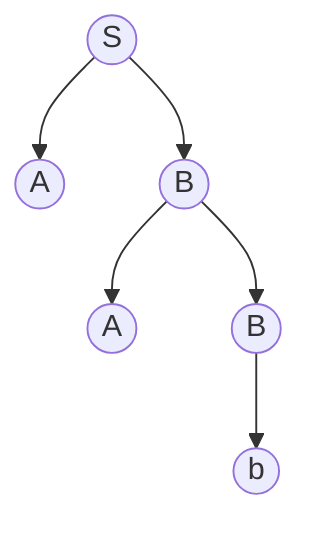

# Context-free languages
###### A context-free language which is not regular  
**Proposition**  
The language $\{a^nb^n |n ∈\mathbb{N}\}$ is context-free, but not regular.

###### Parse trees  
**Definition**  
A parse tree for a context-free grammar is a tree labelled by terminals, non-terminals and $ε$ subject to the following rules:
1. The root is labeled $S$.
2. A vertex is a leaf iff it is labeled by a terminal or $ε$.
3. For every non-leaf $v$ there is a rule with the label of $v$ on the left, and the concatenation of the child labels on the right.

A parse tree is a graphical representation of a derivation in a context-free grammar. It shows the structure of the derivation as a tree, where each node represents a nonterminal symbol, and each leaf represents a terminal symbol or the empty string.

Here is an example of a parse tree for the string "aabb" generated by the context-free grammar $G = ({S, A, B}, {a, b}, S, P)$ where $P$ is the set of productions:

In the parse tree, the nonterminal symbol $S$ is the root node, and it has two children representing the nonterminal symbols $A$ and $B$. The node for $A$ has a single child representing the terminal symbol $a$, while the node for $B$ has two children representing the nonterminal symbol $A$ and the terminal symbol $b$. The node for the right child of $B$ has a single child representing the terminal symbol $b$. Together, the parse tree shows the derivation $S \Rightarrow AB \Rightarrow aAb \Rightarrow aaBb \Rightarrow aabb$.

**Theorem**
The language generated by a context-free grammar consists exactly of the words built from the terminals on the leaves of finite parse trees, in order.
**Parse trees**  
To show that a word belongs to the language of a context-free grammar, try to construct a parse tree bottom-up.

**Closure properties**  
**Theorem**  
Context free languages are closed under  
1. Union  
2. Concatenation  
3. Kleene-star  
4. Intersection with regular languages

##### Non-closure properties  
**Theorem**  
Context free languages are not closed under  
1. Intersection (consider $\{a^nb^nc^m |n, m ∈\mathbb{N}\}$ and  $\{a^nb^mc^m |n, m ∈\mathbb{N}\})$  
2. Complement (consider $\{uw ||u|= |w |∧u \neq w \}$)

# Pushdown automata

##### A stack  
Reminder: A stack can be implemented by a list, where we can  
only  
1. look at the first element of the list (including testing whether there is none),  
2. remove the first element of the list,  
3. and append a new element to the front of the list.

In automata theory, a stack is a data structure used by pushdown automata (PDA) to keep track of the history of the input read so far. The stack is a last-in, first-out (LIFO) data structure that allows the PDA to remember information about previously processed input symbols and to use this information to make decisions about future input symbols.

The stack in a PDA is typically implemented as an abstract data type that supports two operations: push and pop. When the PDA reads an input symbol, it can push information onto the stack, and when it needs to make a decision about the next input symbol, it can examine the top of the stack to determine what action to take. The PDA can also pop information from the stack to backtrack to a previous state if necessary.

The use of a stack allows PDAs to recognize non-regular languages, which cannot be recognized by finite automata. By allowing the PDA to keep track of previous input symbols, the stack adds a level of memory and context to the automaton, which allows it to recognize more complex patterns in the input.

##### Pushdown automata - Informal  
- Basic idea: A pushdown automaton is a finite automaton equipped with one single stack. 
- When choosing an outgoing transition, we can take both the input symbol and the top of the stack into account.  
- Upon completing a transition, we can either push a symbol onto the stack or pop it.

###### Formal definition  
**Definition**  
A pushdown automaton over an alphabet $Σ$ is given by a tuple $(Q,Γ,δ,F)$ where  
1. $Q$ is the set of states, there is a special start state $q_0 ∈Q$, and $F ⊆Q$ is the set of final states.  
2. $Γ$ is the stack alphabet, with a special symbol $⊥ \notin Γ$ indicating that the stack is empty.  
3. $δ ⊆Q ×(Σ ∪\{ε\}) ×(Γ ∪⊥) ×Q ×(Γ ∪⊥)$ is the transition relation.

###### Configurations  
**Definition**  
1. A configuration of a pushdown automaton is an element of  $Q ×Γ^∗$.  
2. The initial configuration is $(q_0,ε)$.  
3. If the current configuration is $(q,α_0α)$, the current input symbol is a and $(q,a,α_0,q′,β) ∈δ$ for $β \notin ⊥$, then a valid subsequent configuration is $(q′,βα_0α)$.  
4. If the current configuration is $(q,ε)$, the current input symbol is a and $(q,a,⊥,q′,β) ∈δ$ for $β \notin ⊥$, then a valid subsequent configuration is $(q′,β)$.
5. If the current configuration is $(q,α_0α)$, the current input symbol is a and $(q,a,α_0,q′,⊥) ∈δ$, then a valid subsequent configuration is $(q′,α)$.
6. If the current configuration is $(q,α_0α)$ and $(q,ε,α_0,q′,β) ∈δ$ for $β \notin ⊥$, then a valid subsequent configuration is $(q′,βα_0α)$ which we can reach without progressing on the input.
7. If the current configuration is $(q,ε)$ and $(q,ε,⊥,q′,β) ∈δ$ for $β \notin ⊥$, then a valid subsequent configuration is $(q′,β)$ which we can reach without progressing on the input.
8. If the current configuration is $(q,α_0α)$ and $(q,ε,α_0,q′,⊥) ∈δ$, then a valid subsequent configuration is $(q′,α)$ which we can reach without progressing on the input.
9. The accepting configurations are $(q,⊥)$ for $q ∈F$.

##### Accepting inputs  
**Definition**  
A word is accepted by a pushdown automaton if we can reach an accepting configuration upon reading it.  
**Theorem**  
A language is recognized by a pushdown automaton iff it is generated by a context-free grammar.

**Some facts on pushdown automata**  
- The requirement that the stack needs to be emptied is not used by everyone – but we DO use it in this module.
- We could push multiple symbols on the stack at the same time.  
- If we would use a queue instead of a stack, we get something more powerful (witness $\{ww |w ∈Σ^∗\}$).
- If we had two stacks, we could recognize all computably enumerable languages.
- We don’t have an analogue to the powerset construction – we can’t require our pushdown automata to be deterministic.

# Pumping Lemma for context-free languages
**Lemma**  
If $L$ is context-free, then there is some $k ∈\mathbb{N}$ such that for every $p ∈L$ with $|p|≥k$ there is a splitting $p = uvwxy$ where $|vx|≥1$ and $|vwx|≤k$ such that for all $i ∈\mathbb{N}$ it holds that $uv^iwx^iy ∈L$.

The pumping lemma for context-free languages is a tool used to prove that a given language is not context-free. It states that if a language $L$ is context-free, then there exists a constant $p > 0$ (called the pumping length) such that every string $s$ in $L$ of length $|s| \ge p$ can be written as $s = uvxyz$, where:

1.  $|vxy| \le p$
2.  $|vy| \ge 1$
3.  For all $i \ge 0$, the string $uv^ixy^iz$ is also in $L$.

In other words, for any string $s$ in $L$ of sufficient length, we can split it into five parts: $u$, $v$, $x$, $y$, and $z$, such that $v$ and $y$ can be "pumped" (repeated any number of times) without changing whether the resulting string is still in $L$.

The pumping lemma can be used to prove that a language is not context-free by assuming that it is context-free, and then showing that there exists a string in the language that cannot be pumped. If a language fails to satisfy the pumping lemma, it is not context-free.

It is important to note that the pumping lemma only provides a sufficient condition for a language to be context-free, and not a necessary one. That is, there exist context-free languages that do not satisfy the pumping lemma, and there also exist languages that are not context-free, but do satisfy the pumping lemma.

###### Pumping Lemma for context-free languages, contraposition  
Consider a language L.  
1. If for every $k ∈\mathbb{N}$ we can chose some $p ∈L$ with $|p|≥k$,
2. such that for every splitting $p = uvwxy$ such that $|vx|≥1$ and $|vwx|≤k$,
3. we can find some $i ∈\mathbb{N}$ with $uv^iwx^iy \notin L$,
4. then $L$ is not context-free.

###### First example  
We want to show that $L = \{a^nb^nc^n |n ∈\mathbb{N}\}$ is not context-free.  
1. Given the pumping length $k ∈\mathbb{N}$, we pick $a^kb^kc^k ∈L$.
2. If $a^kb^kc^k = uvwxy$ with $|vx|≥1$ and $|vwx|≤k$, we distinguish two cases:  
3. Case A: There is no $c$ in $vx$. Then $uv^0wx^0y = uwy$ has $k$-many c’s, but not also both k-many $a$’s and $b$’s. Thus, $uwy \notin L$.  
4. Case B: There is no a in vx. Then $uv^0wx^0y = uwy$ has $k$-many $a$’s, but not also both $k$-many $b$’s and $c$’s. Thus, $uwy \notin L$.  
5. Thus, L is not context-free.

